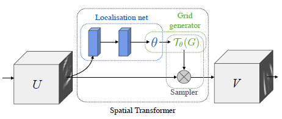
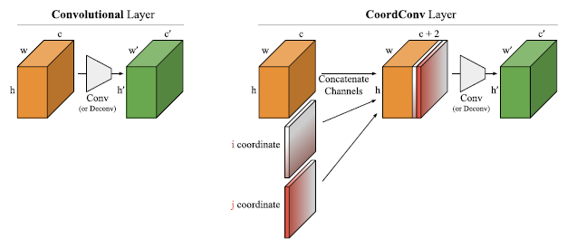
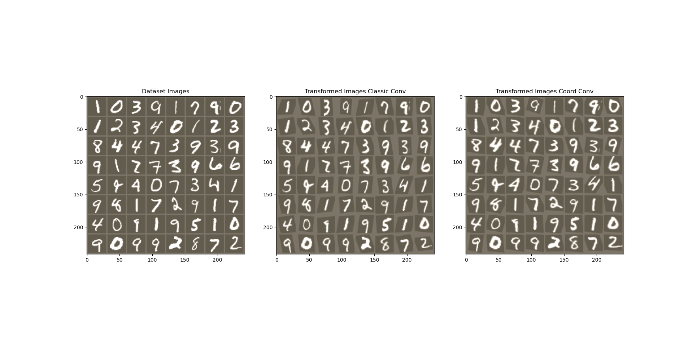

# Spatial-Transformer-Networks

Repository with the implementation in PyTorch of a visual attention mechanism called Spatial Transformer
Networks (STN) for MNIST classification.
Based on the paper: "Spatial transformer networks", Max Jaderberg et al., Advances in neural information processing systems, 2015, vol. 28, p. 2017-2025. https://arxiv.org/abs/1506.02025 

STNs allows a neural network to perform spatial manipulation on the input data within the network to enhance the geometric invariance of the model. 

CNNs are not invariant to rotation and scale and more general affine transformations. In STNs the localization network is a regular CNN which regresses the transformation parameters. The transformation network learns automatically the spatial transformations that enhances the global accuracy on a specific dataset.

STNs can be simply inserted into existing convolutional architectures without any extra training supervision or modification to the optimization process.

In this repository also an implementation of STNs with the addition of CoordConv layers is provided. 

Convolutions present a generic inability to transform spatial representations between two different types: from a dense Cartesian representation to a sparse, pixel-based representation or in the opposite direction. CoordConv layers were designed to solve this limitation modifying the traditional convolutional layers by adding information about the coordinates of the input images to the input tensor. The CoordConv layer is designed to be used a substitute of the regular Conv2D layer.

CoordConv layers are presented in the paper:  "An intriguing failing of convolutional neural networks and the coordconv solution", Rosanne Liu et al., arXiv preprint arXiv:1807.03247 (2018). 
https://arxiv.org/pdf/1807.03247.pdf

Results of image warping for the MNIST dataset. 

